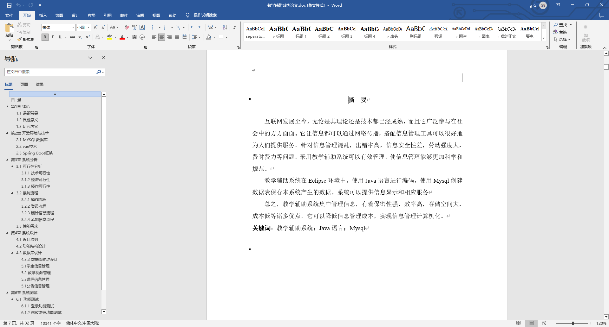
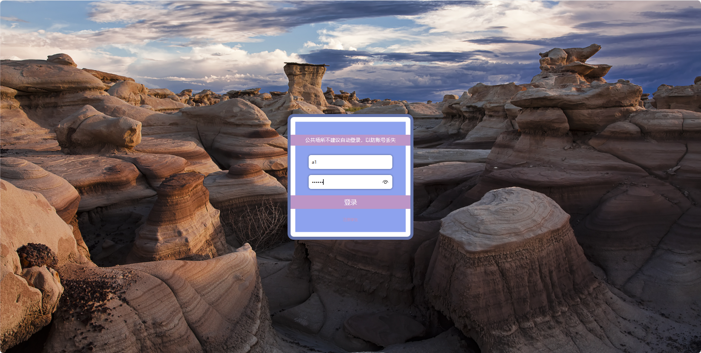
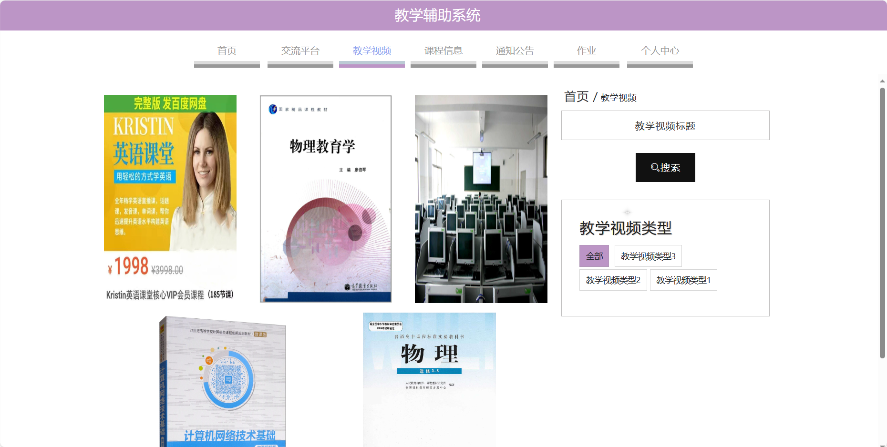
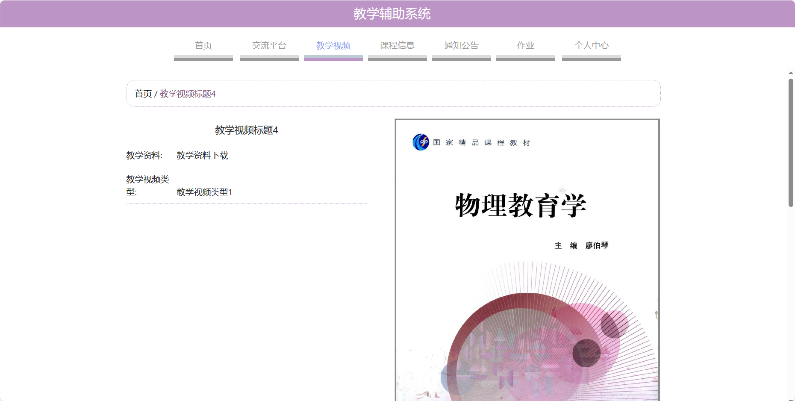
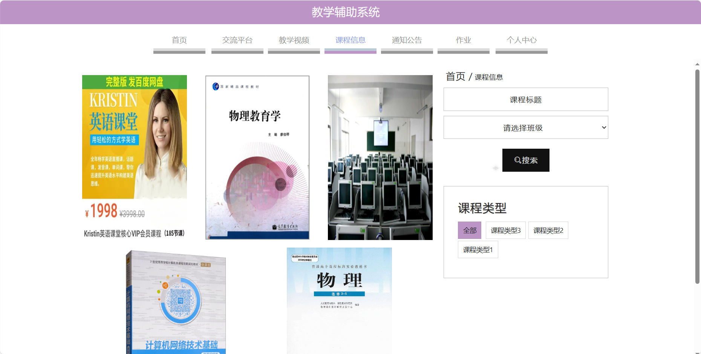
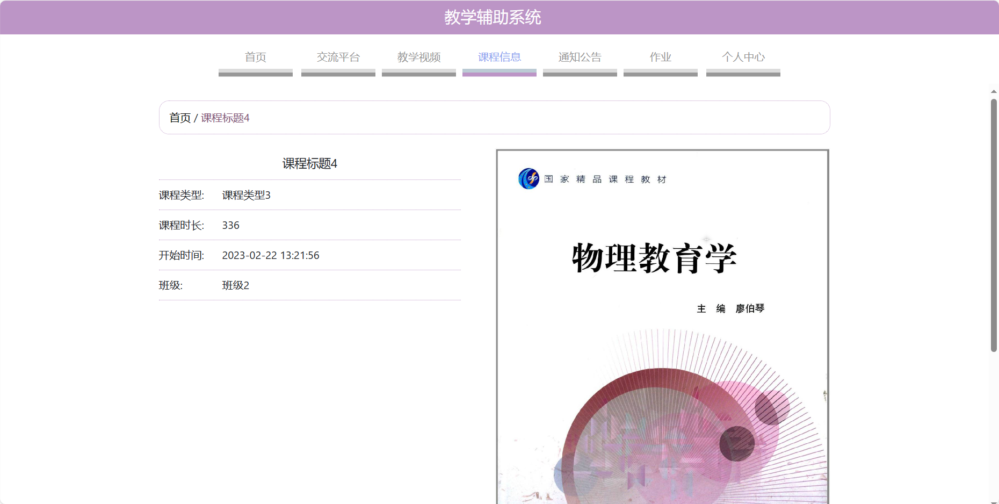
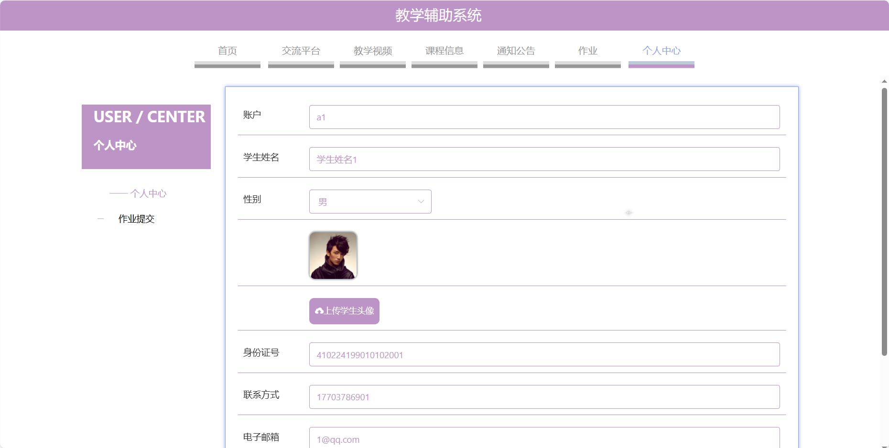
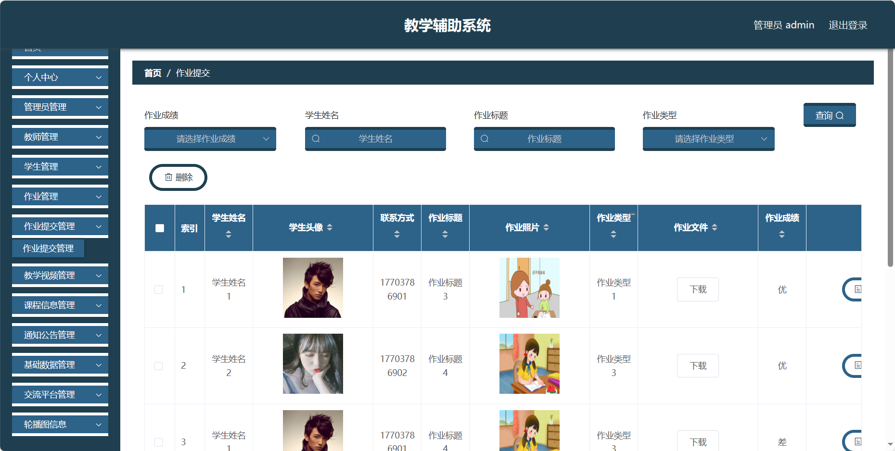

## 基于SpringBoot的教学辅助系统(程序+报告)

###  获取sql数据库文件: 从戎源码网 (https://armycodes.com/) QQ: 386869957 QQ群: 377586148
###  所有系统地址: (https://github.com/YuLin-Coder/AllProjectCatalog) 
###  所有项目以及源代码本人均调试运行无问题 可支持远程安装部署调试、定制修改、代码讲解

## 项目介绍
基于SpringBoot的教学辅助系统，系统包含三种角色：管理员、用户,教师主要功能如下。

【用户功能】

1. **首页：** 用户登录后的系统主页，显示通知公告等相关信息。
2. **交流平台：** 学生和教师可以在这里进行互动和交流等。
3. **教学视频：** 提供在线观看的教学视频。
4. **课程信息：** 查看当前课程的详细信息等。
5. **通知公告：** 查看学校或教师发布的通知和公告。
6. **作业：** 查看布置的作业任务、截止日期等。
7. **个人中心：** 用户个人信息的管理中心。

【管理员功能】

1. **首页：** 显示系统的整体概况。
2. **个人中心：**
   - **修改密码：** 修改管理员账户的登录密码。
   - **个人信息：** 查看和编辑管理员的基本信息。
3. **管理员管理：** 管理系统中的管理员账户。
4. **教师管理：** 对教师账户进行管理。
5. **学生管理：** 对学生账户进行管理。
6. **作业管理：** 管理作业的发布。
7. **作业提交管理：** 查看学生提交的作业情况等。
8. **教学视频管理：** 管理教学视频。
9. **课程信息管理：** 管理课程信息。
10. **通知公告管理：** 管理通知公告。
11. **基础数据管理：**
    - **班级管理：** 维护系统中的班级信息。
    - **教学视频类型管理：** 管理教学视频的分类。
    - **课程类型管理：** 管理课程的分类。
    - **公告类型管理：** 维护通知公告的分类。
    - **作业类型管理：** 管理作业的分类。
    - **作业评分管理：** 设定作业的评分标准。
12. **交流平台管理：** 管理学生和教师的交流平台等。
13. **轮播图信息：** 管理系统首页的轮播图信息。

【教师功能】

1. **首页：** 显示个人信息。
2. **个人中心：**
   - **修改密码：** 修改个人账户的登录密码。
   - **个人信息：** 查看和编辑个人基本信息。
3. **学生管理：** 查看自己所教班级的学生信息。
4. **作业管理：** 布置作业、查看作业详情等。
5. **作业提交管理：** 查看学生提交的作业情况。
6. **教学视频管理：** 上传、删除教学视频。
7. **课程信息管理：** 查看当前课程信息。
8. **通知公告管理：** 发布和管理通知公告。
9. **交流平台管理：** 管理学生和教师的交流平台

## 项目技术
- 编程语言：Java
- 数据库：MySQL
- 项目管理工具：Maven
- 前端技术：HTML、CSS、JavaScript、Jquery、Vue
- 后端技术：Spring、SpringMVC、MyBatis

## 运行环境
- JDK版本：JDK1.8及以上
- 开发工具：IDEA、Ecplise、Myecplise都可以
- 数据库: MySQL5.7及以上
- Maven：maven3.0及以上
- Node：14.14.0及以上

## 运行截图

